 

 
 
<table border="0">
<tr>
<!-- LEFT: animated ASCII portrait -->
<td align="center" valign="middle" width="50%">

</td>
<!-- RIGHT: info card -->
<td valign="middle" width="50%">
<h3>About Me</h3>
<ul>
<li>Software Engineering graduate of Istinye University.</li>
<li>Working on <b>AI Engineering, MLOps, LLM</b> and <b>NLP</b> architectures.</li>
<li>Currently building AI agents and autonomous systems.</li>
<li>Off the keyboard: Push/Pull/Legs at the gym and five-a-side football.</li>
</ul>
<h3>Tech Stack</h3>

<h3>Featured</h3>

<a href="https://www.ayranai.com"><b>AyranAI</b></a> is a live B2B SaaS platform that matches international students with Turkish universities.

<h3>Contact</h3>
<!-- TODO: add the email link, e.g. <a href="mailto:you@example.com">Email</a> | -->
<!-- TODO: add the LinkedIn link, e.g. <a href="https://linkedin.com/in/your-handle">LinkedIn</a> -->

Contact links coming soon.

</td>
</tr>
</table>
 

